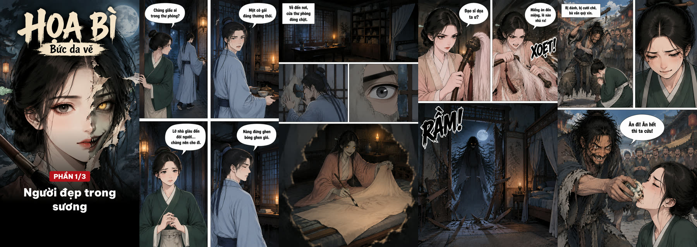

# comic-skill · Tạo truyện tranh bằng AI cho coding agent

Skill miễn phí cho **Claude Code, Codex, Antigravity** (hoặc bất kỳ coding agent nào đọc được `SKILL.md`).
Đưa một ý tưởng, kịch bản hoặc cả một truyện có sẵn, agent sẽ tự:

- ✍️ **Viết kịch bản truyện tranh** theo từng tình tiết, tự chia thành các phần 8–10 trang (mỗi phần một bài đăng)
- 🧑‍🎨 **Tạo nhân vật, bối cảnh, đạo cụ** để giữ đồng nhất qua mọi trang
- 👗 **Nhiều "look" cho mỗi nhân vật** (bác sĩ Minh mặc blouse / mặc đồ thường, cô gái / con quỷ…), mặt vẫn giữ nguyên
- 📐 **Bố cục trang theo nhịp kể**: khung toàn cảnh, chia đôi khi đối thoại, khung lớn cho cú lật
- 💬 **Bóng thoại chữ tiếng Việt** (hoặc ngôn ngữ bạn chọn), chữ to đọc rõ trên điện thoại
- 🔍 **Tự soát chữ từng khung**, sai thì vẽ lại (tối đa 1 lần/trang để tiết kiệm)
- 📦 **Xuất** bộ ảnh 9:16 chia sẵn từng phần cho TikTok/Facebook, **PDF** và **CBZ**



## Cài đặt: một câu là xong

Mở Claude Code / Codex / Antigravity và gõ:

> Clone skill https://github.com/huynhcongdac/comic-skill rồi làm cho tôi truyện tranh "Họa bì" (Liêu Trai Chí Dị), 3 phần

Agent tự clone, hỏi API key, viết kịch bản, tạo ảnh, soát lỗi và xuất file.

## Chi phí

Mặc định dùng **[sangtao.ai](https://sangtao.ai/vi/imagine?tab=pricing)**: **khoảng 100–400đ/ảnh** tùy gói, mỗi ảnh nhận tới 20 ảnh tham chiếu (giữ nhân vật đồng nhất).

| Ví dụ | Số ảnh (gồm sheet nhân vật + vẽ lại) | Chi phí |
|---|---|---|
| 1 phần truyện ~10 trang | ~25–30 | khoảng 3.000–12.000đ |
| Truyện "Họa bì" 3 phần, 28 trang (demo) | ~60 | khoảng 6.000–24.000đ |
| 100 trang truyện | ~130 | khoảng 13.000–52.000đ |

Lấy API key tại [sangtao.ai](https://sangtao.ai) (API cần gói ảnh hoặc credit) · [Tài liệu API](https://sangtao.ai/vi/api-docs/chatgpt-image).
Có sẵn key OpenAI? Đặt `IMAGE_PROVIDER=openai` cũng chạy được.

## Cài thủ công

```bash
git clone https://github.com/huynhcongdac/comic-skill ~/.claude/skills/comic      # Claude Code
# Codex: ~/.agents/skills/comic · Antigravity: ~/.gemini/antigravity/skills/comic · hoặc .agents/skills/ trong project
pip install pillow numpy
cp .env.example .env    # điền SANGTAO_API_KEY
```

Cần Python 3.10+. Không cần Node hay ffmpeg.

## Lưu ý bản quyền

Chỉ chuyển thể truyện của chính bạn, truyện đã hết bản quyền (ví dụ Liêu Trai Chí Dị, truyện cổ tích, Nam Cao, Vũ Trọng Phụng…) hoặc truyện bạn được phép chuyển thể. Với truyện nước ngoài, agent kể lại bằng lời mới vì **bản dịch cũng có bản quyền**. Nhớ bật nhãn "nội dung AI" khi đăng lên mạng xã hội.

## Giấy phép

MIT. Font [Be Vietnam Pro](https://github.com/google/fonts/tree/main/ofl/bevietnampro) theo SIL Open Font License (`fonts/OFL.txt`).
